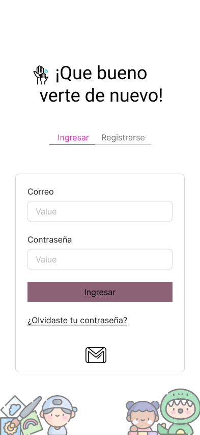
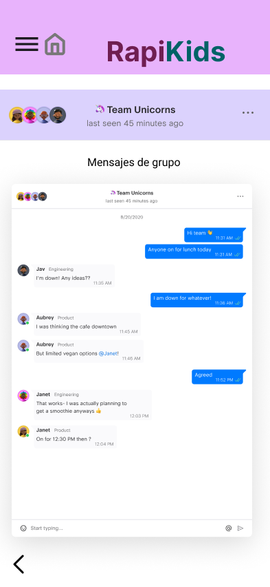

# Diseño de interfaz de usuario

La aplicación tendrá la siguientes pantallas

- Se puede acceder al siguiente link para ver la aplicación interactiva
https://www.figma.com/proto/poZmxMWWUmsVSpCaOJgoII/Rapikids?node-id=3-359&t=SSJ1agInqvKv0aG0-1

1. Pantalla 1: Frame

2. Pantalla 2: Registro

3. Pantalla 3: Inicio sesion

4. Pantalla 4: Inicio

5. Pantalla 5: Menu

6. Pantalla 6: Reservas

7. Pantalla 7: Reservas_hora

8. Pantalla 8: Resumen_servicio

9. Pantalla 9: Metodo de pago

10. Pantalla 10: Pago exitoso

11. Pantalla 11: Mensajes

12. Pantalla 12: Mensajes de grupo

13. Pantalla 13: Mensajes de chat 

14. Pantalla 14: Contactos

15. Pantalla 15: Agregar contacto

16. Pantalla 16: Reservas guardadas

17. Pantalla 17: Ajustes

18. Pantalla 18: Cerrar sesion

19. Pantalla 19: Eliminar cuenta

20. Pantalla 20: Entretenimiento

21. Pantalla 21: Educacion

22. Pantalla 22: Notificacion de reserva guardada

# Referencias

- [Material Design: Foundations](https://m3.material.io/foundations)
- [Material Design: Style](https://m3.material.io/styles)
